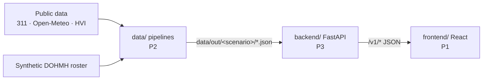

# Nervana — Hackathon Work Split

As of Sat 19 Sep 2026, 16:15. Code freeze Sun 12:00, submission deadline 12:30.

Three people work in parallel, each in their own folder. They share only the shapes in `contracts/`, so nobody waits on anybody: everyone builds against the example files there and switches to the real thing when it lands.

| Person | Folder | Builds | Guide |
| --- | --- | --- | --- |
| P1 | `frontend/` | Care-team inbox, patient detail, risk map, help requests, patient page | [frontend/README.md](../frontend/README.md) |
| P2 | `data/` | Data pipelines + PTSD risk scoring → JSON files | [data/README.md](../data/README.md) |
| P3 | `backend/` | API, recommendations, clinician workflow, deploy | [backend/README.md](../backend/README.md) |
| Shared | `contracts/` | Data file and API shapes + example files | [contracts/README.md](../contracts/README.md) |

## How the pieces connect



P2 writes files, P3 serves them and adds the workflow, P1 shows them. P2 decides *who is at risk and why*; P3 decides *what to do about it*.

## Timeline and checkpoints

| When | Checkpoint | Owner |
| --- | --- | --- |
| Sat 16:30 | Everyone has read their guide and started setting up their folder | All |
| Sat 17:15 | Each part runs alone on fixtures: frontend shows the inbox; backend answers every endpoint; `data/out/demo/` exists | All |
| Sat 17:15 | Data readout in Slack: PTSD patient count, veteran field yes/no, demo patient, replay day | P2 |
| Sat 18:30 | First real data files pushed; backend serves them | P2, P3 |
| Sat 19:15 | Full-stack check on one laptop: backend on real data, frontend with mocks off | All |
| Sat 19:30 | Day 1 wrap: note what's broken and who takes it | All |
| Sun 10:00 | Deployed (Render + Vercel) and the full demo loop works | P3 + all |
| Sun 11:00 | Stop adding features; rehearse the demo twice | All |
| Sun 11:30 | Record the backup demo video | P3 |
| Sun 12:00 | Code freeze | All |
| Sun 12:30 | Submission deadline | — |

If we're behind at 19:30 Saturday, everyone drops their Should tasks.

**Full-stack check (19:15):**

```
git pull
cd backend  && source .venv/bin/activate && uvicorn app.main:app --reload --port 8000
cd frontend && VITE_USE_MOCKS=false npm run dev      # second terminal; open http://localhost:5173
```

## Working rules

- **Push after each major change**: a screen works, an endpoint works, a pipeline step works. Post one line in Slack when you do.
- **If a shape changes, push the contract.** Update `contracts/README.md` and the matching fixture in the same commit, and say so in Slack. Adding fields is safe; ask before renaming or removing one.
- Only edit your own folder. If you need something from another folder, ask its owner.
- Run `git pull --rebase` before every push.
- Secrets go in `.env` files, which are gitignored.
- The repo is public. Keep the synthetic dataset out of it until the repo is private or the organizers confirm it can be public.

## Demo script (about 3 minutes)

1. Map at 9pm on the replay day: Long Island City shows high risk.
2. Inbox: R.M. is flagged **act**. Open the patient detail and walk through the reasons, the confidence and caveats, and the next step. Mark outreach.
3. Patient page: R.M. taps **I need help**. 988 and 911 show first, then R.M. gives consent to notify the care team.
4. Help requests: the clinician reads the doctor bundle and writes a personal plan.
5. Patient page: the clinician's plan appears above the standard tips.
6. Close on the roadmap: FHIR / CDS Hooks for EHR alerts, live data, wearables, pharmacy data.
